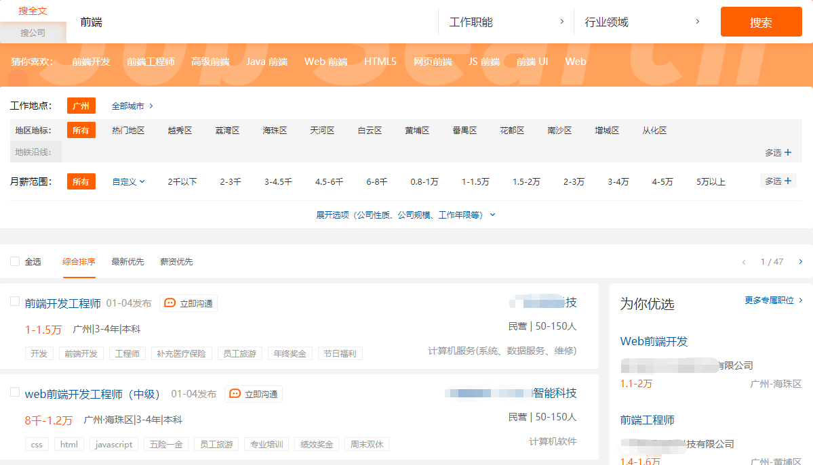

# 重复请求处理——取消未完成的旧请求

> 在某些场景下，同个接口重复请求时（参数不同），如果第一次请求的耗时比第二次请求耗时长，那么会导致页面最终渲染的是第一次请求的结果，由此产生错误的显示。


## 可能会出现此问题的场景

### 列表筛选



“列表筛选”的场景也可以采用加个锁的形式来处理，每选一次条件就显示loading，杜绝了重复请求的可能性。但是对于手快的用户来说并不友好，操作不够流畅，可酌情使用。

### 搜索建议


“搜索建议”这种场景就不可能加锁了，限制输入频率用户绝对会炸毛的。

---

通常这类场景：
1. 不能采用取消后续发起请求的方式来处理，因为每一次的请求都是获取不一样的结果。
2. 不能采用防抖/节流的方式来处理，因为很难把控间隔时间，用户的网络环境是不确定的，如果响应时间长仍然会发生重复发起请求的情况，防抖需要设置延时，实际上也导致接收响应的时间延后，影响用户体验。

这类场景的频繁请求同个接口是不可避免的，所以解决方案的目标应该是：**每当发起请求时，如果该接口有旧请求还在等待响应，那么取消旧请求。**

（PS：已发出的请求，服务端是能够接收并响应的，这里的`取消请求`准确来说应该是取消处理请求结果。）

## 先准备一个能复现问题的小案例

为了能验证后面提到的解决方案，我利用了`koa`搭建了一个服务，并写了个简单的页面。文末我会附上该案例地址，大家也可以尝试一下嗷。

界面是长这样的：


这里我给三个选项的响应分别设置了延时——`全部：1000毫秒`、`类型1：500毫秒`、`类型2：0毫秒`。

依次快速点击`类型1`、`类型2`，最终显示的结果是耗时较长的类型1：


## 方案一：借助 axios 的 CancelToken

如果项目中用的是 axios，那就可以利用 axios 提供的 `cancel token API` 来取消请求。为了方便使用，封装成了如下函数：

```js
import axios from 'axios'
/**
 * 限制重复请求
 * @param {function} callback - 返回 Promise 实例的函数
 * @returns {function} - 新函数
 */
function lastPromise(callback) {
  const CancelToken = axios.CancelToken
  let source = null
  return function(...args) {
    // 如果已存在实例则取消，并触发新的请求
    if (source) {
      source.cancel()
    }
    source = CancelToken.source()
    return callback(...args, source).then((res) => {
      source = null
      return res
    })
  }
}
    
```

### 使用示例：

```js
const getContent = lastPromise((params, source) => {
  return axios({
    url: '/content',
    params,
    cancelToken: source.token
  })
})
```
依次快速点击`全部`、`类型1`、`类型2`，效果如下：

因为`cancel token API`内部调用了 **XMLHttpRequest.abort()** 方法，所以很直观地看到前面两个请求已经是取消状态了。


## 方案二：利用 Promise.race 抢跑
如今异步请求基本都利用 Promise 来接收响应，那么就可以利用 Promise.race 的特性，率先改变一个临时 Promise 的状态为rejected，跳过后续 `then` 方法指定回调的执行。

```js
/**
 * 限制重复请求
 * @param {function} callback - 返回 Promise 实例的函数
 * @returns {function} - 新函数
 */
function lastPromise(callback) {
  let cancelPromise = null
  let cancelToken = null
  return function(...args) {
    // 如果已存在实例则取消，并触发新的请求
    if (cancelToken) {
      cancelToken('cancelPromise')
    }
    cancelPromise = new Promise((resolve, reject) => {
      cancelToken = reject
    })
    return Promise.race([cancelPromise, callback(...args).finally(() => {
      cancelPromise = null
      cancelToken = null
    })])
  }
}
```

发起请求后的执行流程：


### 使用示例：

```js
const getContent = lastPromise(params => {
  return axios({
    url: '/content',
    params
  })
})
```
依次快速点击`全部`、`类型1`、`类型2`，效果如下：

尽管在开发者工具中看到前面两个请求是正常完成的状态，但因为它们的 `Promise.race` 中是 cancelPromise 先改变状态为 `rejected`，因此前面两个请求都是直接跳到 `catch` 方法指定回调的执行(如果有写 catch 的话)，这样就避免了前面比较耗时的请求结果会覆盖新请求的结果。


<p align=center>- END -</p>

---
> 案例克隆地址：`git clone https://gitee.com/huang_kai_da/lastPromise.git` （启动说明在 README.md） 