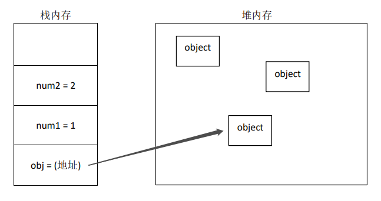
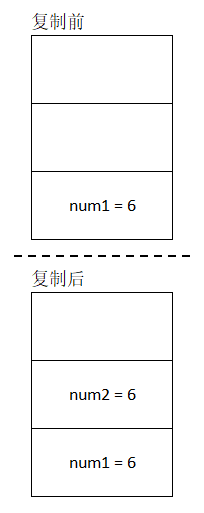
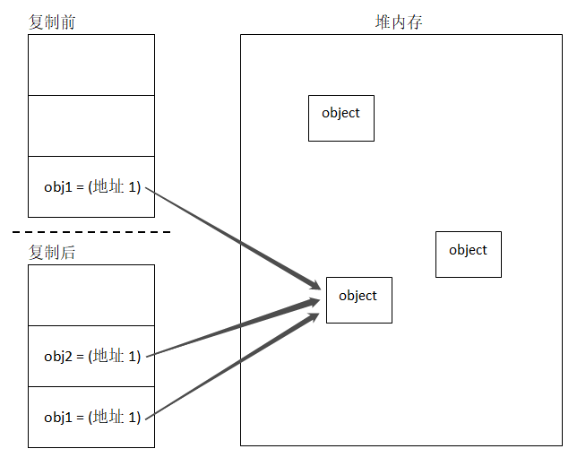

# JavaScript 原始值和引用值


JavaScript 中的变量是松散类型（弱类型）的，没有规则定义某个变量必须是什么数据类型，因此变量的值和数据类型在程序运行过程中可以改变。

JavaScript 存储在变量中的数据类型可以分成两种：

**原始值**：Number、String、Boolean、Undefined、Null、Symbol、BigInt 

**引用值**：Object（其中包括 Array、Function 等等）


## 数据的存储

**原始值**是直接存储在 **栈(stack)** 中的简单数据段，占用空间小、大小稳定，属于会被频繁访问的数据，所以存储在栈中。

**引用值**是存储在 **堆(heap)** 中的对象，占用空间大，大小不固定。同时会在栈中存储一个该对象在堆内存中的内存地址（指针）。




## 值的可变性

在 JavaScript 中，原始值是不可变的，也就是说没有办法去修改一个原始值的本身。原始值只能进行重新赋值操作，这时候会销毁原来的值，并重新分配内存地址保存新的值，变量指向的内存地址产生了变化。

这对于字符串来说可能并不是那么明显，因为字符串看起来像是由字符组成的的数组，并且也可以通过指定索引来获取某个字符，但是能否以此修改字符串中的字符呢，实际上，JavaScript 是禁止这样做的。

```javascript
let str = "hello";
console.log(str[0]); // "h"

str[0] = "H";
console.log(str); // "hello"
```

字符串中的一些方法看似返回了修改后的字符串，实际上返回的是一个新的值，原始字符串的值并未改变。

```javascript
str.toUpperCase(); // 返回 "HELLO"
console.log(str); // "hello"
```


而引用值是可变的——可以随时添加、删除和修改其属性和方法，始终指向同一个对象。

```javascript
let obj = {};
obj.x = 1;
console.log(obj); // {x: 1}

let arr = ["a", "b", "c"];
arr[3] = "d";
console.log(arr); // ["a", "b", "c", "d"]
```


> 区分可变和不可变的关键就是**同一个变量对应存储数据的内存地址有没有变化。**


## 复制值

原始值和引用值在通过变量复制时，行为也有所不同。原始值通过一个变量赋值给另一个变量时，原始值会创建一个新的副本，这两个变量可以独立使用，互不干扰。

```JavaScript
let num1 = 5;
let num2 = num1;

num2 += 1;
console.log(num1, num2); // 5  6
```

原始值的复制过程如下图：



把引用值通过一个变量赋值给另一个变量时，复制的值是栈中的指针，因此两个变量实际上是指向了堆中的同一个对象。对其中一个变量进行改动，也会影响另一个变量。

```JavaScript
let obj1 = {};
let obj2 = obj1;

obj1.name = "小明";
console.log(obj2); // { name: "小明" }
```

引用值的复制过程如下图：




## 值的比较

在 JavaScript 中，原始值之间的比较和引用值之间的比较均是比较在栈中的值。

在原始值之间的比较时，它们的值相等就会被认为相等。

```javascript
let str1 = "hello";
let str2 = "hello";

console.log(str1 === str2); // true
```


而引用值之间的比较时，栈中的指针指向的地址相同，指向同一个对象，才会被认为相等，否则即使两个对象包含同样的属性，也会被认为是不相等的。

```javascript
let obj1 = { x:1 };
let obj2 = { x:1 };
let obj3 = obj1;
let arr1 = [];
let arr2 = [];
let arr3 = arr1;

console.log(obj1 === obj2); // false
console.log(obj1 === obj3); // true
console.log(arr1 === arr2); // false
console.log(arr1 === arr3); // true
```


## 参数传递

ECMAScript 中所有函数传递都是按值传递的，所谓按值传递，就是传递变量对应栈中的那个值。也就是说，给函数传递参数时，相当于**从一个变量赋值到另一个变量**。

> ECMAScript 中函数的参数就是局部变量。

原始值：

```javascript
function add(num){
    return num + 1;
}
let count = 5;
let result = add(count); // 此处参数传递的过程可以看作是 num = count
console.log(count); // 5
console.log(result); // 6
```

引用值：

```javascript
function setName(obj){
    obj.name = "小明";
}
let person = {};
setName(person); // 此处参数传递的过程可以看作是 obj = person;
console.log(person); // {name: "小明"}
```

引用值的例子中，虽然 obj 是局部变量，但是 obj 指向的对象是保存在全局作用域的堆内存上的。所以会发生在局部作用域中修改对象的变化反映到了全局的现象。


## 类型检测

#### 1. 操作符 typeof

如果要判断一个变量的类型是否为Number、String、Boolean、Undefined、Null、Symbol中的一种，可以使用 `typeof` 操作符。如果值是对象或 null ，那么 typeof 都会返回 "object"。

```javascript
let s = "Nicholas"; 
let b = true; 
let i = 22; 
let u; 
let sym = Symbol();
let n = null; 
let o = new Object(); 
 
console.log(typeof s);   // "string"
console.log(typeof i);   // "number" 
console.log(typeof b);   // "boolean" 
console.log(typeof u);   // "undefined"
console.log(typeof sym) // "symbol"
console.log(typeof n);   // "object" 
console.log(typeof o);   // "object" 
```

 typeof 操作符的其他可能返回值如下：

| 类型                       | 结果                                                         |
| -------------------------- | ------------------------------------------------------------ |
| Function                   | "function"（按照ECMA-262规范实现 call() 方法的对象都会返回"function"） |
| 正则表达式                 | "object"（Safari 5及之前版本和 Chrome 7及之前版本会返回 "function" ） |
| BigInt（ES 2020 新增）     | "bigint"                                                     |
| 宿主对象（由 JS 环境提供） | 取决于具体实现                                               |


#### 2. 操作符 instanceof

通常我们不会关心一个值是不是一个对象，而是它到底是什么类型的对象。这种情况下需要使用`instanceof`操作符。

```javascript
console.log(person instanceof Object);  // 变量 person 是否为 Object
console.log(colors instanceof Array); // 变量 colors 是否为 Array
console.log(pattern instanceof RegExp); // 变量 pattern 是否为 RegExp
```

按照定义，所有引用值都是 Object 的实例，因此用 instanceof 检测一个引用值是否为 Object 时都会返回 true。但是如果用 instanceof 检测一个变量是否为某个原始值，则始终会返回false，因为原始值不是对象。


## 总结

原始值特点：

1. 原始值大小固定，因此保存在栈内存中。
2. 原始值是不可变的，只能重新赋值，这个过程会销毁旧值然后重新分配内存存储新值。
3. 通过变量赋值复制时，会创建该值的副本。
4. 原始值之间的比较，它们的值相等就会被认为相等。
5. 要确定值的原始类型使用 typeof 操作符。

引用值特点：

1. 引用值是对象，大小不固定，因此保存在堆内存中，并且会在栈内存中保存指向这个对象的指针（引用）。
2. 引用值是可变的，可以对值的本身进行修改。
3. 通过变量赋值复制时，只会复制指针，结果是两个变量都指向同一个对象。
4. 引用值之间的比较，实际上是比较它们是不是同一个对象。
5. 要确定值的引用类型使用 instanceof 操作符。

参数传递：

1. 给函数传递参数时，相当于**从一个变量赋值到另一个变量**。


<center>- END -</center>
