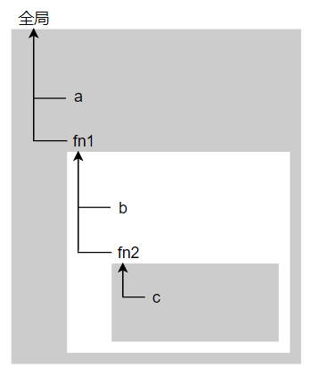

# JavaScript 作用域和作用域链


## 什么是作用域？

作用域(scope)是一套规则，规定了在哪里以及如何查找变量（包括函数），或者说规定了变量、函数声明的可访问范围。

#### 1. 局部作用域

**实例1：**

```javascript
function fn() {
    var str = "fn1";
    console.log(str);
    // 函数内可访问 str
}

fn();
console.log(str); //此处无法访问 str
```

实例1代码中，函数 fn 中声明了一个变量 str ，这种是只能在函数内部区域起作用的**局部变量**，而在函数外部是无法访问的。因此，由函数声明而界定的作用域也被称作**函数作用域**。

------

**实例2：**

```javascript
if (true) {
    let a;
}
console.log(a); // 报错，a 没有定义

while (true) {
    let b;
}
console.log(b); // 报错，b 没有定义

{
    let c;
}
console.log(c); // 报错，c 没有定义

function fn () {
    let d;
}
console.log(d); // 报错，d 没有定义; 这并不奇怪，var 声明也会导致报错
```

实例2代码中，所有变量都是 `let`关键字声明的。它们的作用域由最近的一对花括号`{}`界定，这种被称为**块级作用域**。

（`const`关键字声明的常量也是如此）

#### 2. 全局作用域

在函数或者代码块（`{}`）最外层声明的变量是**全局变量**，在整个 JavaScript 脚本（包括函数和代码块）里都可使用，拥有**全局作用域**。

**实例：**

```javascript
var str = "fn1";
function fn() {
    console.log(str);
    // 此处可访问 str
}

fn();

console.log(str); //此处也可访问 str
```


## 作用域链

前面说过，作用域是一套根据标识符（变量名、函数名）查找变量的规则。实际开发中，通常会出现多个作用域。当一个块或函数嵌套在另一个块或函数中时，就发生了作用域的嵌套。

因此，在当前作用域中无法找到某个变量时，JavaScript 引擎就会往上一层作用域中继续查找，依次类推，直到找到该变量，或者到达最外层作用域（也就是全局作用域）为止，这条单向的索引路径就是**作用域链(scope chain)**。

**实例1：**

```javascript
var a = 1;
function fn1() {
	let b = 2;
    
	function fn2() {
		let c = b;
        b = a;
        a = c;
		console.log(a, b, c); // 这里可以访问 a、b 和 c 
	}
	
    // 这里可以访问 a 和 b，但不能访问 c
	fn2();
	console.log(a,b);
}

//这里只可以访问 a
fn1();
```

下图展示了实例 1 代码中的作用域链，以及各个层级作用域中的标识符：



-----

**实例2：**

```javascript
var a = 1;
function fn() {
    let a = 2;
    console.log(a);
}
fn(); // 2
```

实例 2 代码中，在控制台输出的是 2 而不是 1，因为已经在函数作用域内找到了一个匹配的变量 a 。也就是说在查找到第一个匹配的标识符便会停止查找，这可叫作“短路效应”。因此在不同层级的作用域可以定义同名的标识符而不会被覆盖。

> 使用 var 在全局作用域中声明的变量会自动成为全局对象（比如浏览器中的 window 对象）的属性，因此可以间接地通过对全局对象属性的引用来对其进行访问。例：window.a ;
> （let、const 声明不会添加到全局对象中去）
> 通过这种方式可以访问那些被同名变量所阻断访问的全局变量。但非全局的变量如果被阻断了，无论如何都无法被访问到。

-----

**实例3：**

```javascript
function fn() {
    str = "fn1";
    console.log(str);
    // 函数内可访问 str 
}
fn();
console.log(str); //在全局范围也可访问 str
```

实例 3 代码中，在函数内省略了 `var` 直接给变量 str 进行了赋值，JavaScript 引擎会根据作用域链的查找规则查找这个变量的声明，如果最终在全局作用域中也找不到，这种情况在**非严格模式**下，会使得全局作用域中自动创建一个名为 str 的全局变量，但是在**严格模式**下会报错。在局部作用域中定义全局变量会很难维护，因为一下子很难断定是不是故意省略的，非严格模式下也不推荐使用。


> 函数参数也被当做函数中的变量，访问规则跟其他变量相同。

## 词法作用域

JavaScript 中的作用域模型是词法作用域，可以理解为静态作用域。也就是说变量的作用域在你写代码的时候就已经固定了，取决于函数声明和代码块（`{}`）的书写位置。

其他块级作用域显然是无法改变的，但是函数作用域呢？这里可以直接抛出结论：无论函数在哪里调用，被如何调用，它的作用域都限定于函数声明所处的位置。

**实例1：**

```javascript
var a = 1;
function fn1(){
    console.log(a);  
}
function fn2(){
    let a = 2;
   	fn1(); // 在另一个函数内调用也不会改变作用域嵌套关系
}
fn1(); // 1
fn2(); // 1
```


> 词法作用域查找只会查找一级标识符，比如 a、b 和 c。如果代码中引用了obj.bar.beer， 词法作用域查找只会试图查找 obj 标识符，找到这个变量后，对象属性访问规则会分别接管对 bar 和 beer 属性的访问。

严格来说，词法作用域并不是绝对固定的。JavaScript 中有两个机制可以在运行时动态修改作用域：eval( ) 和 with。但都是弊大于利的操作，而且几乎没有必须要使用它们的情况，在严格模式下它们也会被限制，这里就不过多展开了。


## 总结

1. 作用域是一套规则，限制着变量和函数声明的可访问范围。
2. 作用域分为全局作用域、函数作用域和块级作用域。
3. 作用域之间会发生嵌套关系，子作用域能够访问父作用域的变量，而父作用域不能访问子作用域中的变量。
4. JavaScript 采用词法作用域，作用域固定在函数声明和代码块（`{}`）的书写位置，不会随着函数调用位置而改变。


<center>- END -</center>

