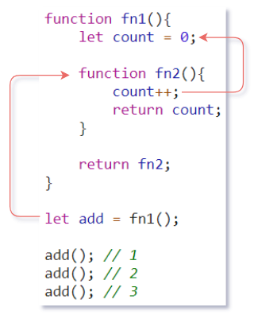
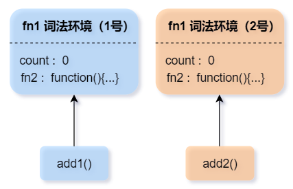
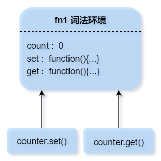

# JavaScript 闭包

<p></p>
## 前言

闭包是 JavaScript 中一个重要的概念，同时这个概念也十分令人费解。让我觉得最不可思议的一点就是：虽然看到很多网友对闭包的理解不尽相同，但似乎并不影响他们写出正确的代码。


为什么严谨的代码世界里，会出现这种情况？在下才疏学浅，也想尝试去解释解释。那么首先给大家分享一些我看过相对权威的闭包定义。

**维基百科**：

“在计算机科学中，闭包（Closure），又称词法闭包（Lexical Closure）或函数闭包（function closures），是在支持头等函数的编程语言中实现词法绑定的一种技术。闭包在实现上是一个结构体，它存储了一个函数（通常是其入口地址）和一个关联的环境（相当于一个符号查找表）。”

<p></p>
**MDN（Mozilla）**：

“一个函数和对其周围状态（lexical environment，词法环境）的引用捆绑在一起（或者说函数被引用包围），这样的组合就是闭包（closure）。也就是说，闭包让你可以在一个内层函数中访问到其外层函数的作用域。在 JavaScript 中，每当创建一个函数，闭包就会在函数创建的同时被创建出来。”

<p></p>
**《JavaScript 高级程序设计》（第4版）**：

“闭包指的是引用了另一个函数作用域中变量的函数，通常是在嵌套函数中实现的。”

<p></p>
**《你不知道的 JavaScript》（上册）**：

“当函数可以记住并访问所在的词法作用域时，就产生了闭包，即使函数是在当前词法作用域之外执行。”

<p></p>
**《JavaScript 权威指南》（第6版）**：

“从技术的角度讲，所有的 JavaScript 函数都是闭包——它们都是对象，它们都关联到作用域链。”

......

兜兜转转，弯弯绕绕，没想到吧！所有 JavaScript 函数都是闭包！这是怎么回事？

废话不多说，现在就去一层一层揭开闭包的神秘面纱！

> 接下来的内容需要你至少了解过词法作用域，如果你对词法作用域还有疑问，现在是个复习的好机会 → [词法作用域](https://blog.csdn.net/weixin_48276895/article/details/109325171)

<p></p>
## 一、简单的闭包

先简单点说，当**一个函数**引用了**外部作用域的变量**，就产生了闭包。例如：

```javascript
let a = 1; // ←--- 函数引用的外部变量
function add(){ // ←--- 一个函数
    console.log(a);
}
add(); // 1
```

仅此而已？没错，你可能经常写这样子的代码，实际上你已经创建了闭包。虽然闭包存在，但闭包的优势并没有明显的体现。

**闭包只有出现在特定的场景下，才能充分展现出它的威力。**

那么接下来我会再用一个例子去说明这一点。

假设某一个场景下，需要实现一个计数器，也许你一开始会这么写：

```javascript
let count = 0;

function add(){
    count++;
    return count;
}

add(); // 1
add(); // 2
add(); // 3
```

但是，count 是一个全局变量，这样非常地不妥，脚本中其他任何代码都有权修改 count ，万一被意外地修改了怎么办（假设你以后忘了count 是干嘛用的），这种意外甚至有可能导致整个程序出问题。我们不喜欢这种乱了套的行为出现，为了把这种意外扼杀在摇篮之中，必须把 count 隐藏起来！

利用函数 fn1() 把变量 count 封闭在函数作用域内，就能成功地阻止了外部的访问，再不用担心 count 会在别处被修改了，这将会很酷！

```javascript
function fn1(){
    let count = 0;
    
    return count;
}
```

- **“不对啊，这样我们自己也不能修改 count 了！”**

好吧，那就把操作 count 的函数定义在 fn1() 里面，起名为 fn2() ，并且把 fn2() 当作一个值通过 return 命令传递出来，用一个变量 add 接收，所以现在它多了一个名字叫 add 。【代码如下】

要知道函数属于引用类型，看起来是在外部调用的 add() ，其实只是通过不同的标识符引用调用了内部函数 fn2()，根据词法作用域的规则，不管 fn2() 在何处调用，它总能访问到 fn1() 中的 count ，所以调用 add() 就可以间接访问 count 了，并且针对 count 的读写方式只能依赖于 fn2() 的实现，这将会很酷！

```javascript
function fn1(){
    let count = 0;
    
    function fn2(){
        count++;
    	return count;
    }
    
    return fn2;
}

let add = fn1();

add(); // 1
add(); // 2
add(); // 3
```

- **“emmmm，不对劲，一般来说 fn1() 执行完之后，其中的变量不是都销毁了吗？”**

巧妙的是，垃圾回收器首先要确定某个变量不会再被使用，才会销毁它。而 add 保存了对 fn2() 的引用，并且 fn2() 会使用到 count，我们随时都可能调用 add() ，因此 count 会一直保留着，直到 fn2() 这把“钥匙”被销毁，这将会很酷！



```javascript
add = null;
```

将 add 重新赋值为 null，解除了 add 对 fn2() 的引用，因为没有任何办法再调用 fn2() ，所以 fn2() 和 count 所占用的内存都会被释放。

-----

如果在此之前你就接触过闭包，你可能会发现，只要是谈闭包必定出现这样的例子。甚至有朋友会认为这样函数套函数的模式才是闭包。

这里面确实有闭包，但它只是利用了闭包，那闭包的特性是什么呢？

**闭包能使函数总是可以访问外部词法作用域的变量，即使函数在它所处的词法作用域之外被调用。**

在这个例子中：

1. 首先需求是**隐藏**一个变量，所以才利用函数作用域使其成为局部变量。
2. 接着需求是**访问**这个变量，因此创建一个可访问它的内部函数，便产生了闭包。
3. 最终目的是能在**外部**对这个变量进行访问，所以需要把子函数传递出来，而例子中的传递方式是 return ，尽管不能以任意方式对这个变量读写了，但这正是最初的目的。

闭包是这个例子中重要的一环，它提供了在外部访问局部变量的权限，延长了局部变量的生命周期。

也许你在此时会产生疑问，函数访问外部变量跟闭包有什么关系？这不是词法作用域的规则吗？盲生，你发现了华点！

首先要明确的是，闭包是计算机科学中的概念，并不是 JavaScript中独有的。

**闭包是词法作用域规则的副作用**。换句话说就是，首先 JavaScript 中的函数就总是可以访问外部词法作用域的变量，而恰巧这种特性符合了闭包的定义而已。闭包是基于词法作用域书写代码时所产生的自然结果，只要理解了词法作用域，你甚至不需要知道闭包的概念，也能写出这样的代码。

这就是为什么 “所有的 JavaScript 函数都是闭包” ，因为 JavaScript 中的函数总是可以访问外部词法作用域的变量。奇了怪了，难道我一个空函数也能成为闭包了吗，这说不通。

没错，仅凭以上，并不能充足地证明这种说法，所以接下来要深入了解一些底层细节，彻底理解闭包的工作原理，才能搞清楚这一切。请继续往下看 ↓

<p></p>
## 二、词法环境

JavaScript 中，每执行一段可执行代码（函数、代码块`{...}`以及全局代码）都会创建一个与之关联的对象，被称为**词法环境（Lexical Environment）**。词法环境就是俗称的**作用域（scope）**和 **作用域链（scope chain）**的内部实现机制。

词法环境对象包含两个部分：

1. **环境记录（Environment Record）**：一个特殊的内部对象，存储当前代码段中声明的所有变量作为其属性（也包括一些其他信息，例如 `this`的值）。对变量的“读写”都意味着是对环境记录中的属性进行“读写”。
2. **对外部词法环境的引用（outer）**：与外部代码相关联，全局词法环境中没有外部引用，值为 null。

<p></p>
#### 1. 预解析与执行阶段

在一段代码即将执行时，新的词法环境对象被创建，并收集作用域范围内的所有变量声明，存储到环境记录中，例如`let`声明的变量，最初它们会处于**未初始化（Uninitialized）**状态，这意味着引擎知道变量，但仍然要在声明语句之后使用它，这就是所谓的“预解析/预编译”，如果你早已了解过“[变量提升](https://blog.csdn.net/weixin_48276895/article/details/109409290)”的现象，这应该会让你嗅到一丝熟悉的味道，我们将通过词法环境去了解其中真正的原理。

下表大概总结了一些声明在“预解析阶段”的行为：

| 声明方式    | 预解析行为           |
| ----------- | -------------------- |
| var         | 获得默认值 undefined |
| let / const | 未初始化             |
| 函数声明    | 完成初始化           |
| 函数表达式  | 与变量声明一致       |

随着代码执行过程的推进，环境记录也会随之改变，以下例子利用注释的伪代码演示了这种变化：

```javascript
// 预解析 → 全局词法环境 = { 环境记录: { a: <未初始化> }, 外部词法环境: null }
let a; // ----------------环境记录: { a: undefined }
a = 1; // ----------------环境记录: { a: 1 }
a = 2; // ----------------环境记录: { a: 2 }
```

<p></p>
#### 2. 内部和外部词法环境

函数被调用或执行代码块`{...}`的代码时，便会创建一个新的词法环境，那么在程序运行时，可能会同时存在多个词法环境。

```javascript
// 预解析 → 全局词法环境 = { 环境记录: { a: <未初始化>, fn: function(){...} }, 外部词法环境: null }
let a = 1; // ------------环境记录: { a: 1, fn: function(){...} }

function fn(b){
    // 预解析 → fn词法环境 = { 环境记录: { b: 2 }, 外部词法环境: 全局词法环境 }
    console.log(a + b); // 当前词法环境没有 a ，所以会顺着对外部词法环境的引用到外部词法环境中继续找
}
fn(2);
```

上面例子中，函数执行时，会存在两个词法环境，内部（函数）和外部（全局），内部词法环境中引用了外部的词法环境。

**当代码要访问一个变量时 —— 首先会搜索内部词法环境，然后搜索外部环境，然后搜索更外部的环境，以此类推，直到全局词法环境为止，或者期间如果找到匹配的变量就会终止。**

<p></p>
#### 3. 对外部词法环境的引用

所有函数在创建时，就已经记住了它所在的词法环境。原因是所有函数都有名为 `[[Environment]]` 的隐藏属性，该属性保存了创建该函数的词法环境的引用。

让我们再回到前面的计数器案例。

```javascript
function fn1(){
    let count = 0;
    
    function fn2(){
        // 创建时 → [[Environment]]: fn1词法环境
        // 被调用 → fn2词法环境 = { 环境记录: {  }, 外部词法环境: [[Environment]] }
        count++;
    	return count;
    }
    
    return fn2;
}
let add = fn1();
add();
```

执行过程分析：

1. fn1() 被调用时，创建了新的 fn1 词法环境，并返回了已创建但还没调用的 fn2 函数。
2. fn2() 在创建时，通过了隐藏的 `fn2.[[Environment]]` 属性记住了它所在的词法环境。
3. add() 被调用时，实则调用的是  fn2 ()，创建新的 fn2 词法环境，其对外部词法环境的引用获取于 `fn2.[[Environment]]` 属性。
4. fn2() 在执行时，首先在自身词法环境中搜索变量 count ，显然是没有的，那就顺着`[[Environment]]`进入 fn1 词法环境中查找，找到了便修改 fn1 词法环境中的变量 count。

这就是**在变量所在的词法环境中更新变量。**

不管函数在何处调用，都不会改变 `[[Environment]]` 这个隐藏属性指向创建时的词法环境。因此，函数总能访问它创建时所在的词法环境中的变量。

<p></p>
#### 4. 同层级的词法环境

如果调用多次 fn1() ，便是创建了多个计数器，它们各自都有独立的词法环境，属于同层级的词法环境，不存在嵌套关系，互不影响访问各自的 count。

```javascript
function fn1(){
    let count = 0;
    
    function fn2(){
        count++;
    	return count;
    }
    
    return fn2;
}

let add1 = fn1();
let add2 = fn1();
add1(); // 1
add1(); // 2
add2(); // 1
```

如图：



-----

如果 fn1() 中不止返回一个内部函数，并且它们的词法环境是同层级的，那么它们会拥有共同的一个外部词法环境，它们修改获取都是同一个 count 。

```javascript
function fn1(){
    let count = 0;
    
    function set(){
        count++;
    	return count;
    }
    
    function get(){
        return count;
    }
    
    return { set, get };
}

let counter = fn1();
counter.get(); // 0
counter.set(); // 1
counter.get(); // 1
```

如图：



-----

<p></p>
> **词法环境是一个规范对象**
>
> “词法环境”是一个规范对象（specification object）：它仅仅是存在于编程语言规范中的“理论上”存在的，用于描述事物如何运作的对象。我们无法在代码中获取该对象并直接对其进行操作。
>
> 但 JavaScript 引擎同样可以优化它，比如清除未被使用的变量以节省内存和执行其他内部技巧等，但显性行为应该是和上述的无差。

<p></p>
## 三、结合词法环境理解闭包

了解到词法环境之后，也该重新介绍一下 JavaScript 中的闭包了。

**闭包就是一个函数和它外部词法环境的组合体，也可以用这个函数来指代闭包。**

ECMAScript中，**所有 JavaScript 的函数都是天生闭包的**，因为它们的隐藏属性`[[Environment]]` 都保存了对外部词法环境的引用，所以函数总是可以访问外部词法作用域的变量，即使函数在它所处的词法作用域之外被调用。

> [new Function()](https://zh.javascript.info/new-function) 创建的函数例外，因为它不管在何处创建，它的 `[[Environment]]` 总是指向全局环境。


<p></p>
## 四、实际中的引擎优化

那么问题来了，理论上如果函数可访问时，它外部的所有变量也将继续存在。如果利用浏览器的开发者工具进行调试，在执行内部函数时把代码执行暂停，在控制台输入`console.log(value)`，是否能访问 value 呢。

```javascript
function f() {
	let value = "outer";

	function g() {
    	debugger; // 在 Console 中输入：console.log(value); 报错：value is not defined
	}
	
    return g;
}

let g = f();
g();
```

利用上面例子测试会发现，理论上这里应该是可访问的，但实际上，JavaScript 引擎会分析变量的使用情况，没有被内部函数引用的外部变量（局部变量），会被引擎优化掉。

这并不奇怪，因为外部函数 f() 已经执行结束了，而函数 g 明显没有引用 value。

另一种情况：

```javascript
let value = "global";

function f() {
	let value = "outer";

	function g() {
    	debugger; // 在 Console 中输入：console.log(value);
	}
	
    return g;
}

let g = f();
g();
```

上面例子在 Chrome、Edge 和 Opera 浏览器中，如果全局中有定义一个同名变量 value，那么控制台会输出同名的全局变量。如果是 Firefox 浏览器会显示报错`variable 'value' has been optimized out`，指明变量 value 已经被优化掉了。

为什么我会说变量被优化而不是被销毁掉呢，外部函数执行完后变量 value 肯定是被销毁了，但如果把这个例子再修改一下，在外部函数执行结束之前执行内部函数，看看会怎么样：

```javascript
let value = "global";

function f() {
	let value = "outer";

	function g() {
		debugger; // 在 Console 中输入：console.log(value); 输出："global"（Firefox依然报错被优化）
	}

	g();
	console.log(value); // 输出："outer"
}

f();
```

上面例子中，在函数 g() 调用之后，还是可以访问到函数 f() 中的 value 的，而在内部函数调用时 value 还没有被销毁，却还是无法访问！

个人猜测（仅供参考），不同的 JavaScript 引擎都对没有引用外部变量的函数中的 `[[Environment]]`属性做了手脚 ，修改指向了全局环境，或者指向 null。另外如果引用了外部变量，外部词法环境中没有被引用的变量会被优化掉，也就是说，函数中的 `[[Environment]]`得到的是一个删减版的外部词法环境。

无论如何，其显性行为并不会受到多少影响，影响只是调试模式下的问题。

在 ECMAScript 中并没有明确规定要对 `[[Environment]]` 如何优化，理论上它们都会得到完整的外部词法环境，即使编写代码时没有引用任何外部变量。但通过上面的例子可以发现，在各种 JavaScript 引擎的实现上会进行不同程度的优化。

**因此从实践的角度上看，对闭包似乎可以有另外一种理解：函数引用了外部变量时才会形成闭包，否则该函数只是一个普通函数。**

<p></p>
## 五、闭包和内存泄漏

闭包常常被人与内存泄漏联系在一起，所谓内存泄漏就是指一些已经**无法访问**的变量，但是因为垃圾回收机制的缺陷，并没有将其回收，而导致这些变量常驻内存又没有用处。

那么，闭包会造成内存泄漏吗？

**闭包不会造成内存泄漏**，闭包常常用来延长变量的生命周期，是因为这些变量之后还需要使用的，如果把这些变量放在全局，对内存的影响也是一样的，这里并不能说成是内存泄漏。如果将来需要回收这些变量，还是可以手动把变量设置为 `null`。

闭包跟内存泄漏唯一有关联的地方就是——使用闭包的同时比较容易形成循环引用，如果闭包中保存了一些 DOM 节点，并且发生了循环引用，这时候就可能会造成内存泄漏。但这不是闭包的问题，也不是 JavaScript 的问题，而是由于 IE9 以下的浏览器中，对于 BOM 和 DOM 对象的垃圾回收机制采用了引用计数策略，在引用计数策略下，如果两个对象之间形成了循环引用就会导致它们不能被回收，本质上是循环引用造成的内存泄漏，跟闭包无关。同样的，把它们设置为 `null` 就可以解决。

<p></p>
## 六、一些实例

分享一些关于闭包的实例作为拓展，加深对闭包的理解吼！

**实例1**：

```javascript
'use strict';
// 非严格模式可以直接用普通的函数声明
// 严格模式下在块级作用域用普通的函数声明不会提升到全局，要用函数表达式赋值给外部变量
{
	let count = 0;
	window.foo = function(){
		return count++;
	}
}
console.log(foo());

```

隐藏变量不一定需要外部函数，可以使用`{}`和 `let` 关键字创建块级作用域，块级作用域也会产生新的词法环境；把内部函数传递出来也不一定依赖 `return`，可以利用函数表达式，把函数赋值给作用域之外的变量。缺点是不能复用，而外部函数可以多次调用。

-----

**实例2**：

```html
<button class="btn1">点击1</button>
<button class="btn2">点击2</button>
<script>
    function makeCounter(selector){
	let btn = document.querySelector(selector);
	let count = 1;
	btn.addEventListener('click',function(){
		console.log(count);
		count++;
		});
	}
    
	makeCounter('.btn1');
	makeCounter('.btn2');
</script>
```

DOM 事件的回调函数在未来事件触发时才会执行，回调函数会保有 makeCounter() 的词法环境，也是内部函数被传递出来后调用的另一种形式，回调函数在它所处的词法作用域之外被调用了。

-----

**实例3**：

```javascript
function fn1(msg) {
    setTimeout(function(){
        console.log(msg)
    },1000);
}
fn1("我在fn1词法作用域外被调用");
```

定时器的回调函数会在 fn1() 执行完毕的一段时间之后再执行，同样的，回调函数会保有 fn1() 的词法环境，回调函数在它所处的词法作用域之外被调用了。

-----

**实例4**：

```javascript
for (var i=1; i<=5; i++) {
    setTimeout( function() {
        console.log( i );     
    }, i*1000 );
}
// 6; 6; 6; 6; 6 
```

这段代码本意是期望每秒输出一次 i ，依次输出1~5，但实际上是五次6。

因为在循环中，只是调用了定时器函数setTimeout()，回调函数只是定义还没调用。循环结束以后才会执行回调函数，此时 i 的值已经变为 6 。最重要的是，i 和所有回调函数都在同一个词法环境中创建的，它们共享了一个 i ，当回调函数执行时，它们都在同一个词法环境中找到了 `i = 6`。 这里面虽然出现了闭包，但是要注意，**闭包只是保有了对变量的访问权限，而不是存储当时的值**。

所以这里核心的问题其实是——如何能让每个回调函数都能找到具有正确值的变量呢？

解决这个问题思路就是——每次迭代中都要把 i 当时的值存储下来，让回调函数执行时能够输出当时的值。

要做到这一点，必须让每个回调函数分别创建在不同的词法环境，并且每个词法环境都存储 i 的值。

```javascript
for (var i=1; i<=5; i++) {
    (function(j) {         
        setTimeout( function() {
            console.log( j );     
        }, j*1000 );
    })(i); 
}
// 1; 2; 3; 4; 5 
```

这里利用了立即调用函数，每次迭代都会创建新的词法环境，同时把每次迭代的 i 传递进去赋值给形参 j 。当然形参也可以起名为 i ，作用域链已因此被延长，每个回调函数执行时都会找到具有正确值的变量。

另外

for 循环语句头部的 i 如果使用ES6 的`let`声明，也能解决这个问题，并且更加方便。

```javascript
for (let i=1; i<=5; i++) {        
        setTimeout( function() {
            console.log( i );     
        }, i*1000 );
}
// 1; 2; 3; 4; 5 
```

这和立即调用函数是异曲同工之妙，本质上就是把一个代码块封闭成块级作用域，令每次迭代都会产生新的词法环境。let 在这里有一个特殊行为——for 循环头部的 let 每次迭代都会声明一次，随后的每次都会取上一次迭代结束时的值来初始化这个变量。因此，一切都正常了。

-----

**实例5**：

```javascript
var arr = [];
for(var i=0; i<3; i++){
	arr[i] = function(){
		return i;
	}
}

arr[0](); // 3
arr[1](); // 3
arr[2](); // 3
```

这个例子其实跟实例 4 差不多，期望返回的值等于数组索引值0、1、2，你知道如何解决了吗？

-----

**实例6**：

```javascript
var a = 1;
var obj = {
	a: 2,
	arrow:()=>{ // ES6
		console.log(this.a)
	},
	arrow2:(function(){ // ES5
        var _this = this;
		return function(){
			console.log(_this.a);
		}		
	}()),
    arrow3:(function(){
		var _this = this;
		return function(){
			console.log(_this.a);
		}		
	}).call({a:3})
};

obj.arrow(); // 1
obj.arrow2(); // 1
obj.arrow3(); // 3
```

上面例子中， obj.arrow 转换成 ES5 代码就是 obj.arrow2 的形式，可以清楚看到，箭头函数的 `this` 其实是利用闭包固定的，箭头函数里没有自己的 `this`，而是引用外部的 `this` 。

<p></p>
## 总结

1. 闭包就是一个函数和它外部词法环境的组合体，也可以用这个函数来指代闭包。
2. 理论上所有 JavaScript 的函数都是闭包，因为它们的隐藏属性`[[Environment]]` 都保存了对外部词法环境的引用，所以函数总是可以访问外部词法作用域的变量。（`new Function()`创建的函数例外）
3. 由于引擎的优化，实践中只有函数引用了外部变量时才会形成闭包，否则该函数只是一个普通函数。
4. 闭包跟词法作用域和变量的生命周期密切相关，闭包是词法作用域规则的副作用。
5. 闭包常常被用来保持对局部变量的访问，延长局部变量的生命周期。
6. 闭包不会造成内存泄漏，代码逻辑错误、浏览器有缺陷才会导致内存泄漏。

<center style="text-align:center">- END -</center>
-----

> **参考**：
>
> [《现代 JavaScript 教程》- 6.3 变量作用域，闭包](https://zh.javascript.info/closure#tasks) 

